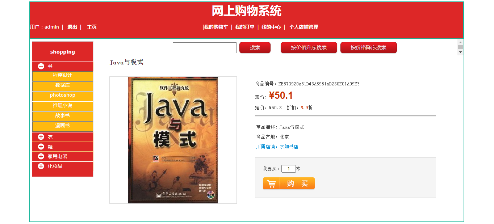

<h1 align="center">网上购物管理系统</h1>

## 简介
网上购物管理系统：角色分为用户和管理员；功能包括用户注册、登录、商品分类浏览、购物车管理、个人信息和密码修改、订单管理、店铺管理和商品搜索排序。    --计算机毕业设计源码；毕设源码；java毕业设计源码

## 联系方式

<h3 align="center">获取完整代码与数据库文件 + 微信：bysj5151 QQ: 86050149 QQ群: 783742310</h3>

<h3 align="center">可帮忙远程部署 包运行成功！提供远程部署、修改代码、设计文档指导、代码讲解等服务！</h3>

## 功能介绍（完整见运行截图）
用户：基本功能包括注册、登录和退出，界面设计简洁明了。可在网站首页通过导航栏浏览商品列表、搜索商品和查看商品详情。用户能在购物车中管理商品，并进行结算和模拟在线付款。用户个人中心允许查看和修改个人信息、查询订单，以及管理收货地址。

管理员：管理员可通过登录注册以进入管理界面，其功能包括主页、店铺信息管理、商品管理和顾客订单管理。管理员能够查看和管理店铺基本信息，监控用户订单，并执行相关操作以优化平台管理。

## 运行截图

本代码来源于网络,仅供学习参考使用!

